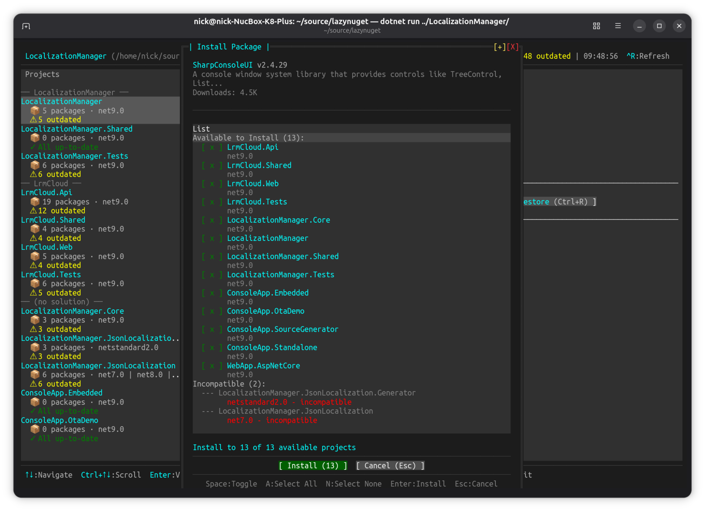
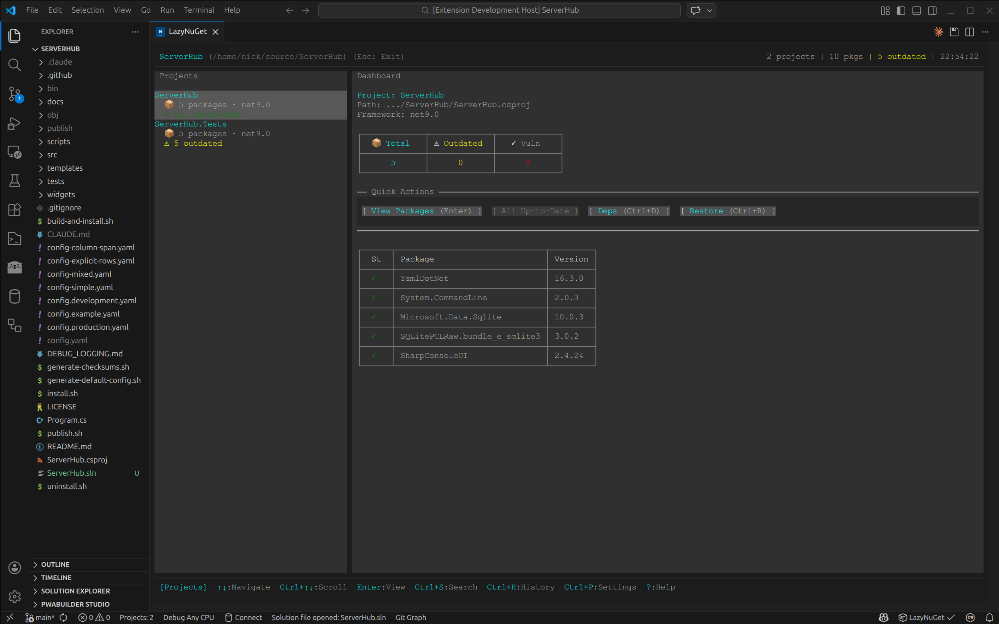

# Screenshots

## Dashboard

The main dashboard shows projects grouped by solution on the left, with a stats overview and quick-action buttons on the right. Outdated packages are highlighted with version bump indicators.

**Features shown:**
- Projects grouped by `.sln` solution in the sidebar
- Per-project package counts and outdated indicators
- Stats cards (Total, Outdated, Vulnerabilities)
- Quick Actions bar (View Packages, Update All, Deps, Restore)

---

## Package Details

Press Enter on any package to view detailed information fetched from NuGet.org, including description, metadata, and available actions.

**Features shown:**
- Package description, authors, license, download count
- Installed vs latest version
- Target frameworks
- Tabbed detail view (Overview / Deps / Versions / What's New / Security)
- Action buttons (Update, Select Version, Deps, Remove)

---

## Version Selector

Choose a specific version for any package with a scrollable, filterable version list.

**Features shown:**
- All available versions with stability tags (latest, current)
- Filter by All / Stable / Pre-release
- Current version highlighted

---

## NuGet.org Search

Search for packages directly from NuGet.org with real-time results.

**Features shown:**
- Live search with download counts and descriptions
- Filter by All Versions / Stable / Pre-release
- Install button to add to any project

---

## Install Planning

When installing from search, choose which projects to install to with a multi-project selection modal.

**Features shown:**
- Per-project compatibility check (compatible / incompatible)
- Checkbox-style multi-project selection
- Space to toggle, A to select all, Enter to install

---

## Update Strategy

When updating all outdated packages, choose a strategy to control which version bumps are applied.

**Features shown:**
- Strategy dropdown (All, Minor & Patch, Patch Only)
- Live preview of which packages will be updated vs skipped
- Skip reason shown for each excluded package

---

## Dependency Tree

Visualize direct and transitive dependencies for any project or package.

**Features shown:**
- Direct and transitive dependency breakdown
- Target framework tabs
- Filter by All / Top-Level / Transitive

---

## Operation History

Full history of all NuGet operations with filtering, rollback, and retry support.

**Features shown:**
- Timestamped operation log (add, update, remove, restore)
- Filter by type and status
- Rollback (undo) and Retry Failed actions

---

## Recent Folders

Quickly switch between recently opened folders with Ctrl+O.

**Features shown:**
- Ordered list of recently opened directories
- Current folder highlighted
- Browse button for new locations

---

## Settings & Custom Sources

Manage NuGet sources and add private feeds with optional credentials.

**Features shown:**
- Source list with enable/disable toggle
- Add Custom NuGet Source modal
- Username and password fields for authenticated feeds

---

## Central Package Management (CPM)

LazyNuGet fully supports projects using [Central Package Management](https://learn.microsoft.com/en-us/nuget/consume-packages/central-package-management) (`Directory.Packages.props`).

**How it works:**
- Projects with `<ManagePackageVersionsCentrally>true</ManagePackageVersionsCentrally>` are detected automatically
- Package versions are resolved from `Directory.Packages.props` — packages no longer appear missing even though their `.csproj` has no inline version
- A `[CPM]` badge appears in the breadcrumb when viewing a centrally-managed project's packages
- Each package shows a `[central]` or `[override]` tag next to its installed version
- **Ctrl+U / Ctrl+V** on a central package writes the new version directly to `Directory.Packages.props`, updating all projects that share that version at once
- **Ctrl+X** removes only the project's `<PackageReference>` entry — the central `<PackageVersion>` in props is preserved for other projects
- `VersionOverride` packages are shown with a `[override]` tag and update via the project file, not the props file

---

## CPM Migration Wizard

Press **Ctrl+G** from the Projects view to migrate all inline-version projects to Central Package Management in one step.

**Features shown:**
- Analysis tab scans all projects and lists which will be migrated and which are skipped
- Version conflicts resolved automatically (highest version wins)
- Migration tab streams live progress output
- Results tab summarises migrated projects, centralised packages, and backup file locations
- Wizard is resizable and movable
- Dashboard hint (`💡 Press Ctrl+G`) appears for any project with inline versions
- Also available headless: `lazynuget --migrate-cpm /path/to/solution`

---

## VS Code Extension

LazyNuGet running natively inside VS Code as an editor tab with full mouse and keyboard support.

**Features shown:**
- Embedded terminal UI in VS Code editor tab
- Full project tree navigation in sidebar
- Package list with status indicators
- Quick action buttons
- Full mouse and keyboard support
