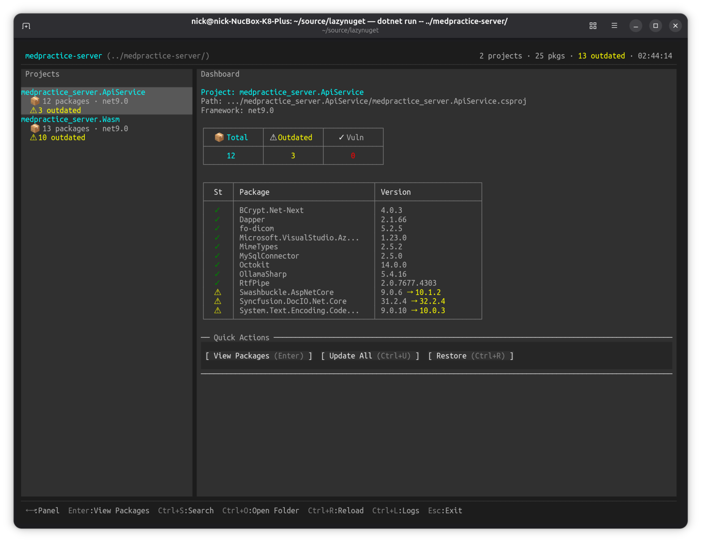
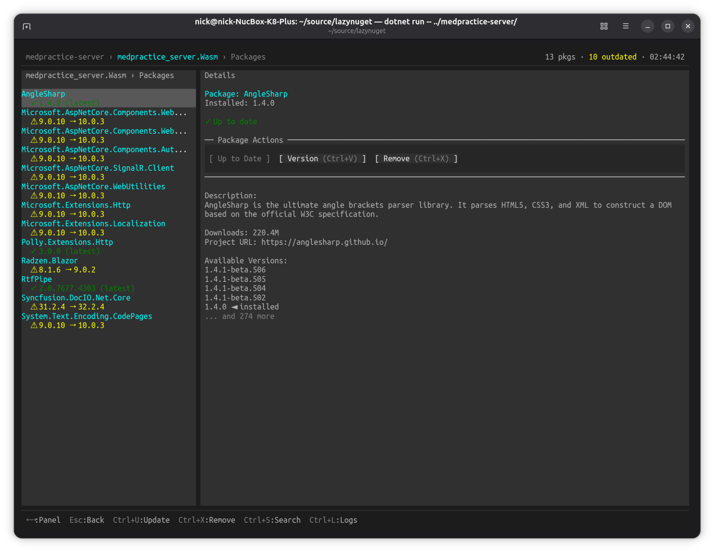
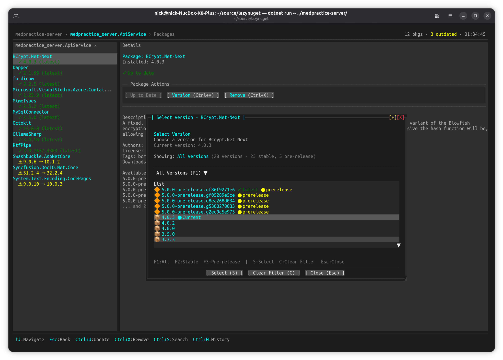
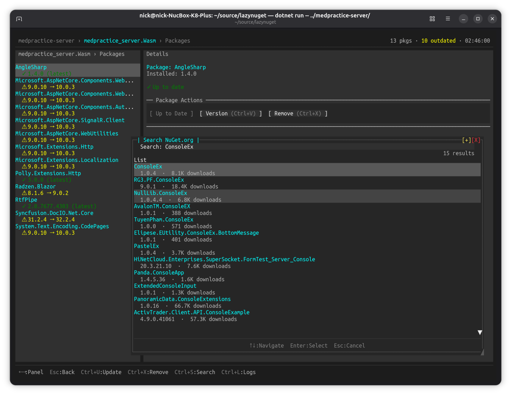
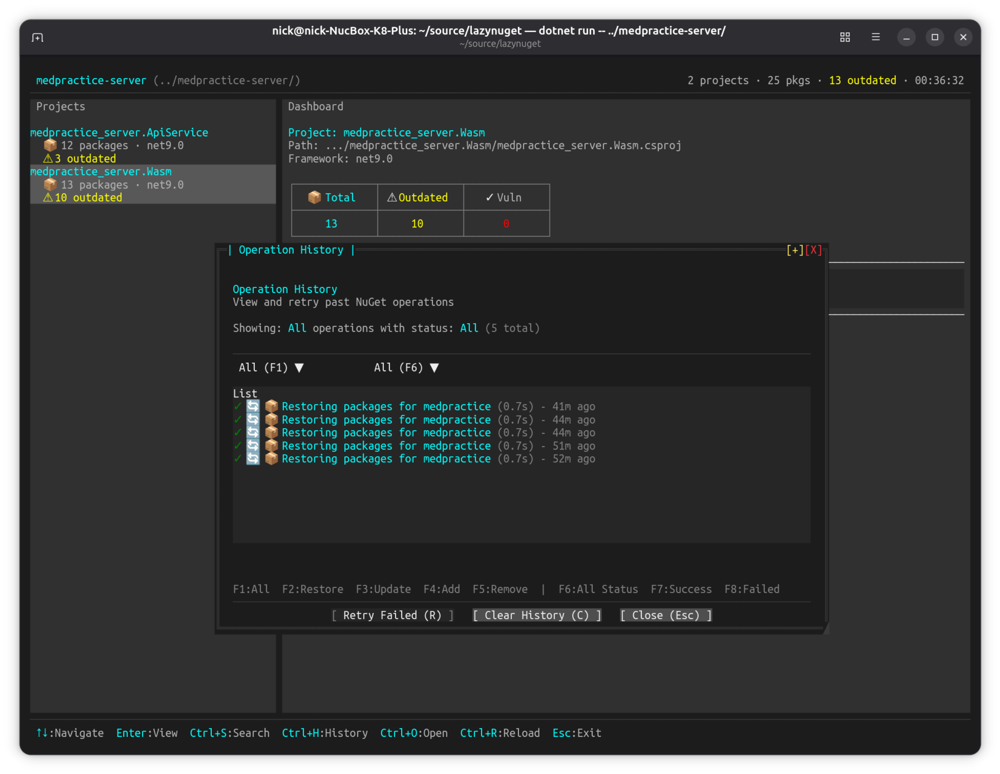
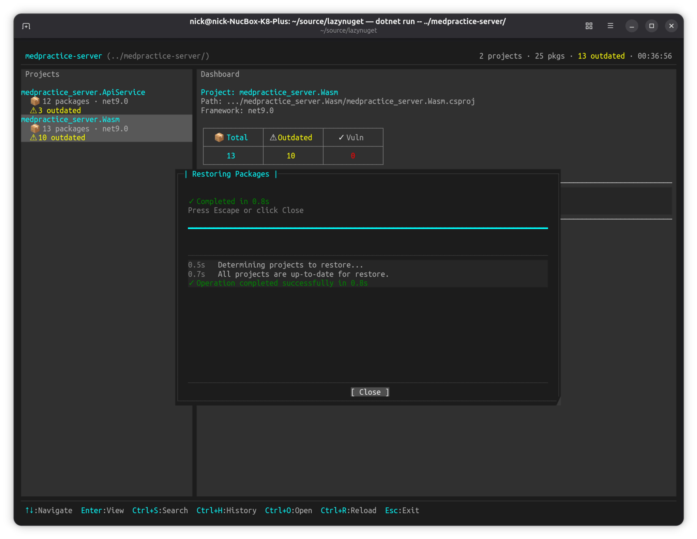
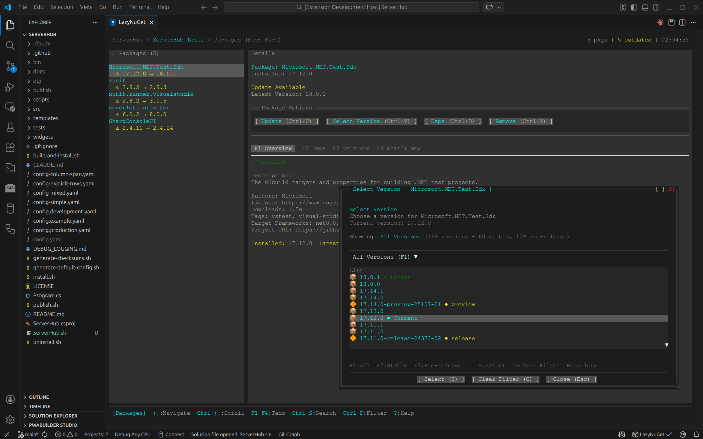

# Screenshots

## Dashboard Overview

The main dashboard shows your project tree on the left and package details on the right. Quickly see which packages are outdated (yellow ⚠ indicators) and navigate with keyboard shortcuts.

**Features shown:**
- Project tree with package counts
- Package list with versions
- Stats cards (Total, Outdated, Vulnerabilities)
- Status indicators for outdated packages
- Quick actions menu

## Package Details

Press Enter on any package to view detailed information fetched from NuGet.org, including description, available versions, and metadata.

**Features shown:**
- Package description and metadata
- Installation version
- Available versions list
- Package actions (Update, Remove)

## Version Selection

When updating packages, choose from all available versions with an interactive version picker.

**Features shown:**
- Scrollable version list
- Keyboard navigation
- Version history from NuGet.org

## NuGet.org Search

Search for new packages directly from NuGet.org with real-time results and metadata.

**Features shown:**
- Real-time package search
- Package descriptions and download counts
- Quick package browsing
- Keyboard-driven interface

## Operation History

View and manage your complete NuGet operation history with filtering, retry capabilities, and detailed logs. Press Ctrl+H to access the history.

**Features shown:**
- Complete operation history tracking
- Dropdown filters for operation type and status
- Keyboard shortcuts (F1-F8) for quick filtering
- Success/failure indicators with durations
- Retry failed operations
- Double-line border modal
- Persistent history stored in JSON

## Restore Progress

All operations now use a unified progress modal with real-time log output, cancellation support, and automatic history recording.

**Features shown:**
- Real-time progress feedback
- Detailed operation logs
- Cancellation support (Esc)
- Operation duration tracking
- Automatic history recording
- Works for all operations (Add, Update, Remove, Restore, Change Version, Update All)

---

## VS Code Extension

### LazyNuGet in VS Code - Dashboard View

LazyNuGet running natively inside VS Code as an editor tab with full mouse and keyboard support.

**Features shown:**
- Embedded terminal UI in VS Code editor tab
- Full project tree navigation in sidebar
- Package list with status indicators (outdated packages highlighted)
- Quick action buttons (Install Package, Update All, Update Package, Remove Package)
- Stats dashboard showing package counts (Total: 5, Outdated: 3)
- Native VS Code integration with status bar
- Full mouse and keyboard support

### LazyNuGet in VS Code - Version Selection

Interactive version selection dialog showing all available versions for a package from NuGet.org.

**Features shown:**
- Modal version selection dialog
- Scrollable list of available versions
- Version tags and labels (e.g., "extreme")
- Package information and description
- Action buttons for version management
- Full keyboard navigation
- Integrated with VS Code's theme
